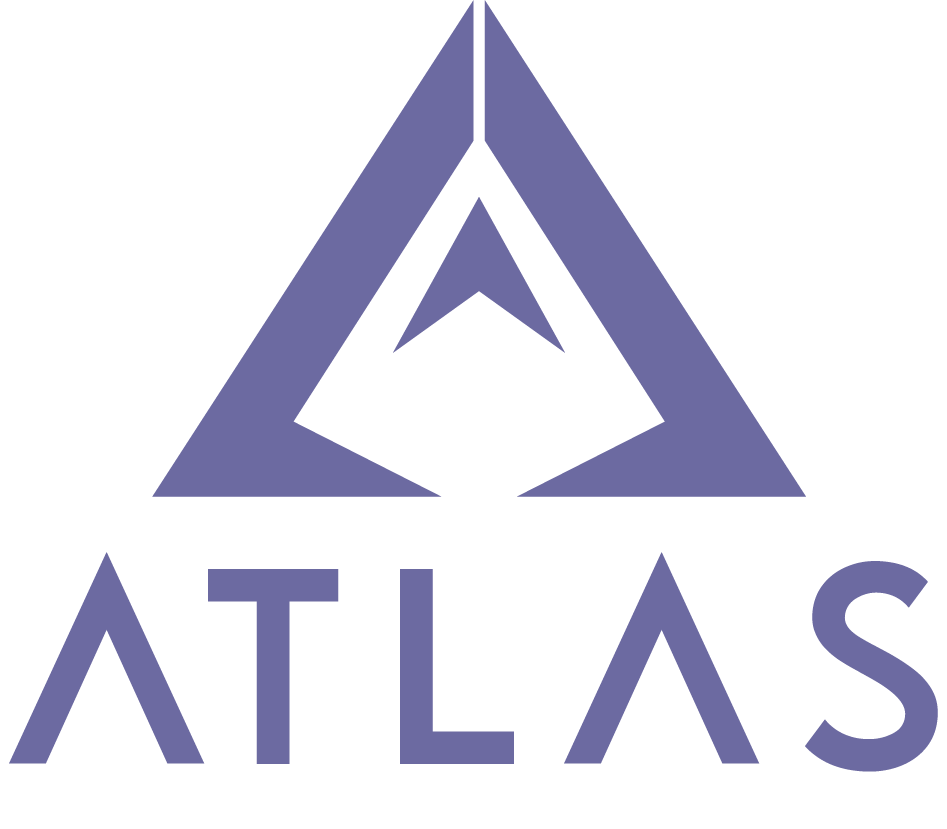

  

## Overview

[Atlas](https://slynyr.github.io/Atlas/) is an open-source resource designed to allow students in the TEJ 3M/4M curriculum to explore, learn, and develop programming skills for ESP32 microcontrollers using the PlatformIO development framework. Atlass comprised of 4 chapters, each of which have been carefully constructed in a way that should be easily approachable to students which may be new to different concepts.

## Contributing

If you have knowledge or experience you'd like to share, we encourage you to contribute to this resource. Your contributions will benefit not only your peers but also future students who rely on Atlas as a learning tool. Whether you have improvements, new content, or corrections, we appreciate your willingness to help make this resource even better. Find out more about how you can contribute [here](https://slynyr.github.io/Atlas/docs/ATLAS/Contributing). 